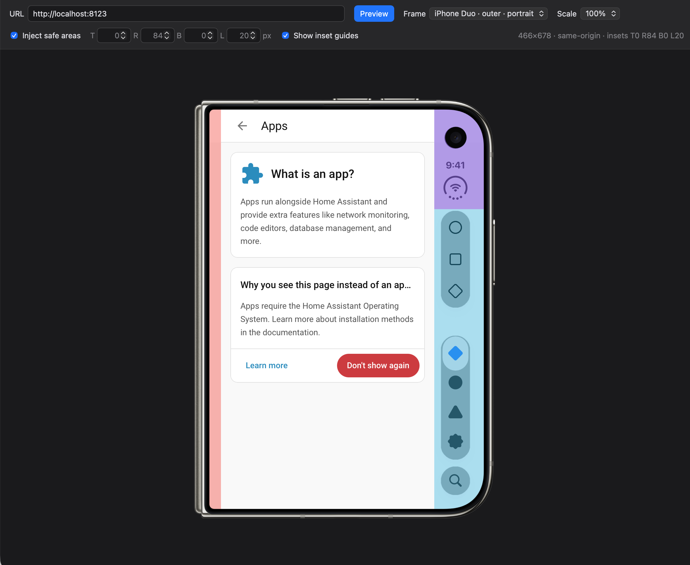

# iPhone Duo Web Previewer

Preview any website inside an iPhone Duo frame, with the display's safe areas applied, before a simulator exists.



## What it does

- Draws the iPhone Duo outer display (portrait) around a 466 × 678 pt viewport.
- Lets you type any URL and renders it inside the screen cut-out.
- Injects the safe areas (top 0, right 84, bottom 0, left 20 px) into the previewed page when it is same-origin.
- Shows translucent guides over the inset regions, which you can hide for clean mockups.
- Keeps every setting in the query string so a view can be bookmarked or shared.

Everything lives in a single `index.html`. No build step, no dependencies.

## Usage

Open `index.html` from any static host, or double-click it to open from disk. Type a URL and press **Preview**.

### Safe areas

The insets are written to the previewed page as CSS custom properties on its `<html>` element:

```css
--app-safe-area-inset-top
--app-safe-area-inset-right
--app-safe-area-inset-bottom
--app-safe-area-inset-left
```

A page that derives its layout from these variables, with `env(safe-area-inset-*)` as the fallback, will lay out exactly as it would on the device. The Home Assistant frontend already does this.

Browsers only allow a page to reach into an iframe of the **same origin**, so injection is automatic only when the previewer is served by the site you are previewing. For everything else:

- The status line explains that the target is cross-origin and offers **Copy inject snippet**.
- Open DevTools, select the preview frame as the console context, and paste the snippet.
- A blank screen means the site refuses to be framed (`X-Frame-Options` or `frame-ancestors`).

### Previewing Home Assistant

Copy `index.html` into your Home Assistant `config/www/` folder and open `http://<your-instance>/local/index.html`. Enter `/` or any dashboard path such as `/lovelace/0`. Since the page is served by the same origin, the safe areas are applied automatically.

### Query parameters

| Parameter | Meaning |
|---|---|
| `url` | Address to preview |
| `preset` | Frame preset, currently `duoOuterPortrait` |
| `insets` | `1` to inject safe areas, `0` to skip |
| `top`, `right`, `bottom`, `left` | Inset values in px, overriding the preset |
| `indicators` | `1` to show inset guides, `0` to hide |
| `scale` | `1`, `0.75` or `0.5` |

## Adding a frame

Presets are a small table at the top of the script in `index.html`: a label, the screen rectangle inside the frame image, and the four insets. Add the frame artwork as an inline SVG with the screen area transparent, register a preset, and it appears in the **Frame** picker.

## Notes

- The inset values are derived from the frame artwork and are a best guess until Apple publishes the real ones.
- The previewer does not change the site being previewed. It only sets the four variables above.
- Rendering uses whatever browser you open the page in. Use Safari for the closest match to WebKit on iOS.
