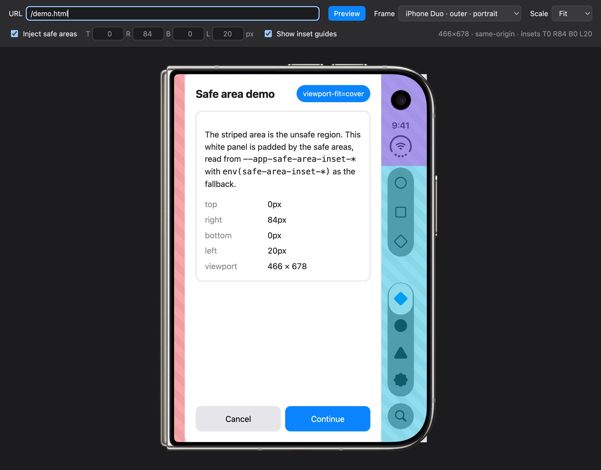
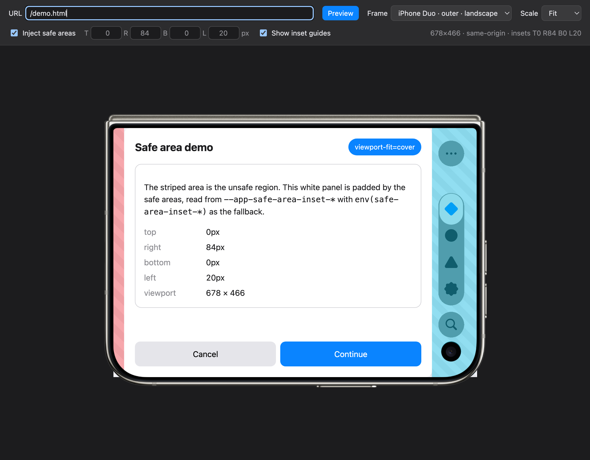
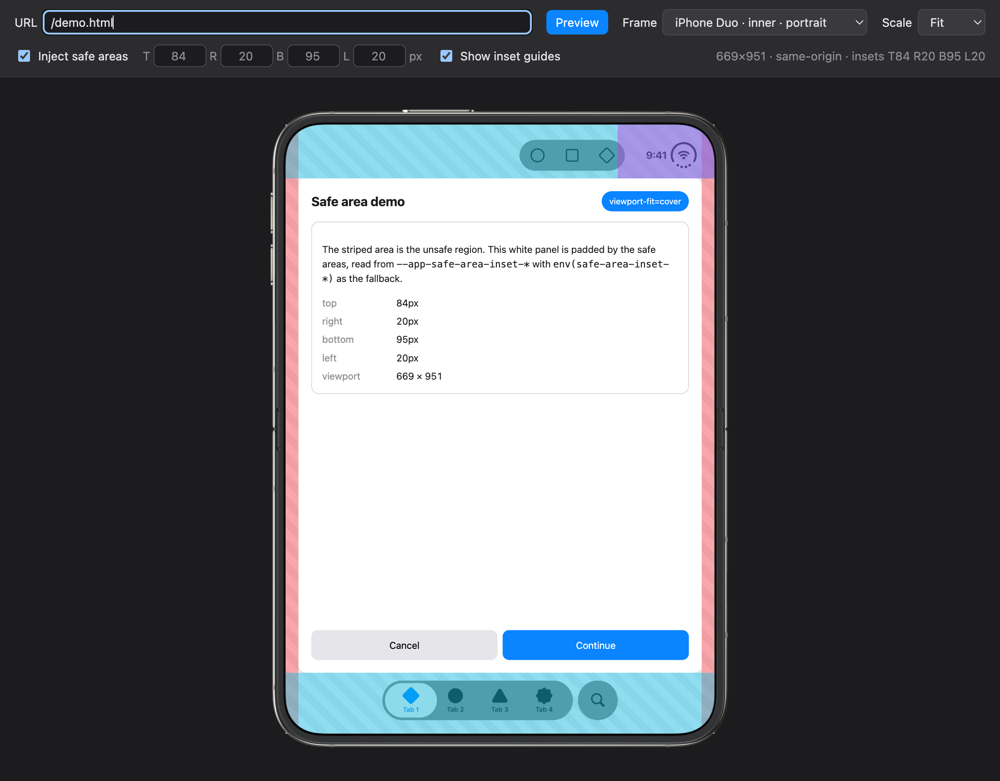
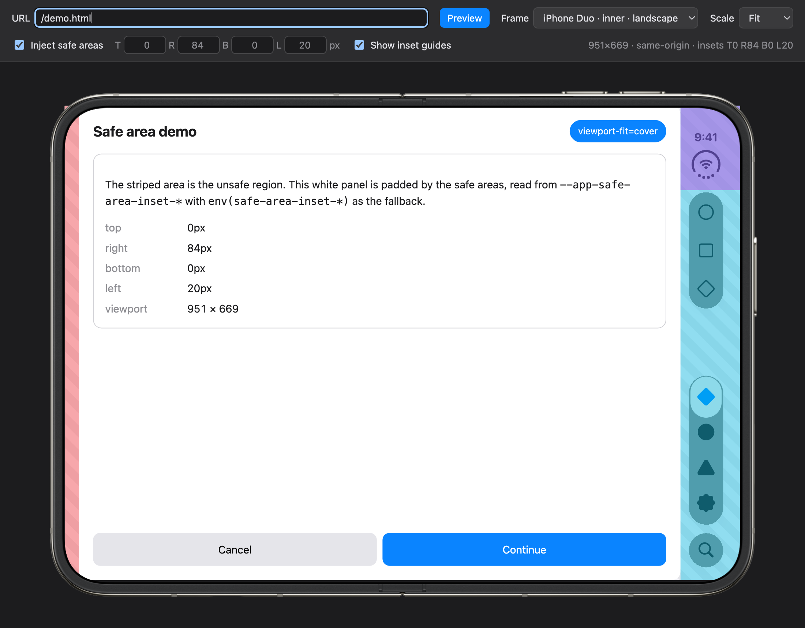

# iPhone Duo Web Previewer

Preview any website inside an iPhone Duo frame, with the display's safe areas applied, before a simulator exists.

**Try it:** <https://bgoncal.github.io/iPhone-Duo-Web-Previewer/?url=demo.html>



## What it does

- Draws the iPhone Duo outer and inner displays, in portrait and landscape, around a viewport of the display's size.
- Lets you type any URL and renders it inside the screen cut-out.
- Injects each display's safe areas into the previewed page. Cross-origin sites are routed through a small local proxy so injection works for any site, local or on the internet.
- Shows translucent guides over the inset regions, which you can hide for clean mockups.
- Keeps every setting in the query string so a view can be bookmarked or shared.

The previewer is a single `index.html`. `serve.js` is an optional local server with a reverse proxy that makes any site same-origin. No build step, no dependencies. `demo.html` is a small page that visualizes the injected safe areas so you can see the mechanism working.

## Quick start

The hosted copy on GitHub Pages is enough to try the frames and the demo page. Because it lives on `bgoncal.github.io`, only `demo.html` is same-origin there. To preview your own site with safe areas injected, run it locally or from your site's origin as described below.

```bash
git clone https://github.com/bgoncal/iPhone-Duo-Web-Previewer.git
cd iPhone-Duo-Web-Previewer
node serve.js
```

Open <http://127.0.0.1:8765/index.html?url=demo.html>. Pick a frame, toggle **Inject safe areas**, and watch the demo page re-pad itself. Then type any address, such as `https://example.com` or `http://localhost:3000`, and it is previewed with safe areas too.

`serve.js` needs Node 18 or newer and nothing else. Pass a port as the first argument to change it, and `--verbose` to log every proxied request.

Any static server, such as `python3 -m http.server 8765`, also serves the previewer, but without the proxy only same-origin pages can be injected. Opening `index.html` straight from disk works as well, but then no page can be same-origin.

## Frames

| Frame | Viewport (pt) | Safe areas (top · right · bottom · left) |
|---|---|---|
| Outer · portrait | 466 × 678 | 0 · 84 · 0 · 20 |
| Outer · landscape | 678 × 466 | 0 · 84 · 0 · 20 |
| Inner · portrait | 669 × 951 | 84 · 20 · 95 · 20 |
| Inner · landscape | 951 × 669 | 0 · 84 · 0 · 20 |

| Outer · portrait | Outer · landscape |
|---|---|
|  |  |

| Inner · portrait | Inner · landscape |
|---|---|
|  |  |

The insets are read from the frame artwork and are a best guess until Apple publishes the real ones. Each value can be edited in the toolbar for a one-off check.

## How the safe areas reach the page

The previewer writes four CSS custom properties on the previewed page's `<html>` element:

```css
--app-safe-area-inset-top
--app-safe-area-inset-right
--app-safe-area-inset-bottom
--app-safe-area-inset-left
```

A site that reads these first and falls back to the real values lays out exactly as it will on the device:

```css
:root {
  --safe-top: var(--app-safe-area-inset-top, env(safe-area-inset-top, 0px));
  --safe-right: var(--app-safe-area-inset-right, env(safe-area-inset-right, 0px));
  --safe-bottom: var(--app-safe-area-inset-bottom, env(safe-area-inset-bottom, 0px));
  --safe-left: var(--app-safe-area-inset-left, env(safe-area-inset-left, 0px));
}
```

`demo.html` is the smallest possible example of this pattern. A site that uses `env()` directly, with no variable in between, cannot be faked by any browser tool. Only the viewport size is previewed in that case.

## Previewing your own site

Browsers only let a page reach into an iframe of the **same origin**, and many sites send `X-Frame-Options` or `frame-ancestors` headers that refuse framing altogether. `serve.js` solves both: when the typed URL is on another origin, the previewer asks the server to reverse-proxy that site under `127.0.0.1:8765`, and the status line reads `same-origin via proxy for <host>`. In-app navigation, redirects, cookies and WebSockets all go through the proxy, and framing headers are removed on the way.

If you would rather not run Node, or want the previewer deployed next to the site, copy `index.html` into the site's static folder so it comes from the same origin:

| Setup | Where to put `index.html` | Then open |
|---|---|---|
| Vite, Create React App, Next.js, SvelteKit | `public/` | `http://localhost:<port>/index.html?url=/` |
| Django, Flask, Rails | the static files directory | `http://localhost:<port>/static/index.html?url=/` |
| Any web server | the document root or a subfolder | `http://<host>/preview/index.html?url=/` |

Rename the file if `index.html` collides with your site's own entry point. Type a path such as `/` or `/settings` in the URL box, and the status line confirms `same-origin` once the insets are applied.

## Cross-domain websites

When the site you want to preview lives on a different origin than the previewer, and `serve.js` is not running, the status line turns yellow and explains it. You have four options.

### 1. Run `node serve.js`

The built-in proxy handles one site at a time and switches automatically when you type a new cross-origin URL. It sets the `Host` header to the target, rewrites `Location` headers and cookies to the local origin, replaces absolute self-references in HTML, CSS and JavaScript, and strips `X-Frame-Options`, `Content-Security-Policy` and `Strict-Transport-Security`. Do this only for sites you own or are allowed to test.

Known limits: a login that bounces through a third-party identity provider usually rejects a `localhost` redirect and leaves the proxy. Sites that bind sessions to their hostname may log you out. A site's own `/index.html` or `/demo.html` is shadowed by the previewer's files.

### 2. Serve the previewer from the site's origin

Copy `index.html` next to the site as described above. This needs no extra tooling and also works for a deployed previewer.

### 3. Put both behind one local origin with a reverse proxy

Useful when you already run a proxy, or want to preview from a real domain. With [Caddy](https://caddyserver.com):

```caddyfile
:8080 {
  handle_path /preview/* {
    root * /path/to/iPhone-Duo-Web-Previewer
    file_server
  }
  handle {
    reverse_proxy https://your-site.example {
      header_up Host {upstream_hostport}
    }
  }
}
```

Then open `http://localhost:8080/preview/index.html?url=/`. Both the previewer and the site are now `localhost:8080`, so injection works.

If the site refuses to be framed, the proxy can also drop those headers for local testing. Do this only for sites you own or are allowed to test:

```caddyfile
    reverse_proxy https://your-site.example {
      header_up Host {upstream_hostport}
      header_down -X-Frame-Options
      header_down -Content-Security-Policy
    }
```

Sites that hard-code absolute URLs to their own domain, or that rely on cookies scoped to it, may not fully work through a proxy.

### 4. Inject by hand from DevTools

Load the cross-origin URL in the previewer, press **Copy inject snippet**, open DevTools, switch the console context to the preview frame, and paste. The snippet sets the four variables once. Repeat it after a full page reload inside the frame.

A blank screen in any of these cases means the site sends `X-Frame-Options` or a `frame-ancestors` policy that refuses framing. Only options 1 and 3 can work around that.

## Setting it up with an AI coding agent

The previewer is a static file, so an agent can set it up in a minute. Paste this into your agent:

```text
Set up the iPhone Duo Web Previewer for me:
1. Clone https://github.com/bgoncal/iPhone-Duo-Web-Previewer.git into a tools folder outside my project.
2. If my project has a dev server with a static/public folder, copy index.html from the clone
   into it as duo-preview.html so it is served from my project's origin, then tell me the URL
   to open, for example http://localhost:<port>/duo-preview.html?url=/
3. Otherwise start the bundled server in the clone on a free port (node serve.js <port>, or
   python3 -m http.server <port> if Node is missing) and tell me to open
   http://127.0.0.1:<port>/index.html?url=demo.html
4. Do not modify my project's source. Do not commit the copied file unless I ask.
5. Report the URL, which frame presets exist, and remind me that safe areas are only injected
   when the previewed page is same-origin.
```

Notes for agents:

- `index.html` is self-contained (about 3.4 MB because four device bitmaps are inlined). Copy it as is.
- Do not edit the site being previewed. The previewer only sets `--app-safe-area-inset-*` on the framed page.
- The frame and insets can be pre-selected through query parameters, see below, so you can hand the user a direct link.
- `serve.js` proxies any cross-origin site typed into the previewer, one at a time, so with it running there is nothing else to set up.
- If the user cannot run Node and cannot add a file to the site, use the Caddy option above.

## Query parameters

| Parameter | Meaning |
|---|---|
| `url` | Address to preview. `demo.html` or `sub/page.html` resolve next to the previewer, `/settings` resolves against its origin, `example.com` gets `https://` |
| `preset` | `duoOuterPortrait`, `duoOuterLandscape`, `duoInnerPortrait` or `duoInnerLandscape` |
| `insets` | `1` to inject safe areas, `0` to skip |
| `top`, `right`, `bottom`, `left` | Inset values in px, overriding the preset |
| `indicators` | `1` to show inset guides, `0` to hide |
| `scale` | `fit` (default), `1`, `0.75` or `0.5` |

## Adding a frame

Presets are a small table at the top of the script in `index.html`: a label, the frame image size, the screen rectangle inside it, and the four insets. Add the frame artwork as an inline SVG with `class="frame"`, a `data-preset` matching the key, and a transparent screen area. Wrap any safe-area guide shapes in a group with `class="indicators"` so the toggle can hide them.

## Notes

- The previewer does not change the site being previewed. It only sets the four variables above. `serve.js` rewrites responses in transit, on your machine only, and never touches the site itself.
- Rendering uses whatever browser you open the page in. Use Safari for the closest match to WebKit on iOS.
